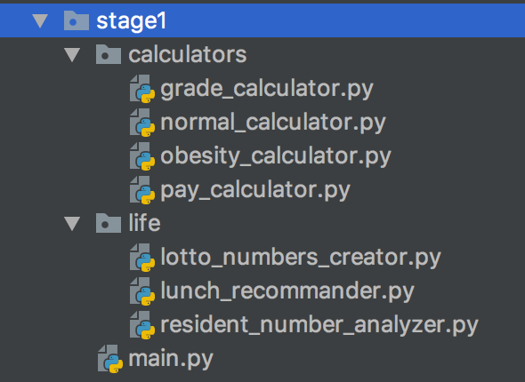
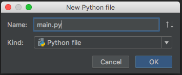
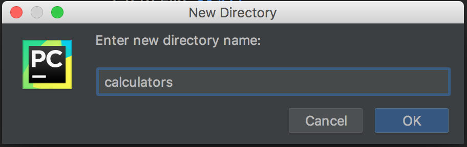

# Stage 1 - 파일과 디렉터리

## 파일과 디렉터리

* 파이썬 파일 : '.py'로 끝나는 확장자를 가진 파일로서, 파이썬으로 작성된 텍스트 파일.
* 디렉터리 : 파일들을 정리하기 위한 파일 캐비넷. 여러 파일들이 디렉리 안으로 묶일 수 있다.

## 파일과 디렉터리를 생성해봅시다!

우리는 파이참에서 위와 같이 project 하위에 main.py 파일을 만들고, calculators, life 두 개의 디렉터리를 생성할 것 입니다.

그리고 calculators 디렉터 하위에는 grade\_calculator.py, normal\_calculator.py, obesity\_calculator.py, pay\_calculator.py 4개의 파이썬 파일을 생성하고요. life 디렉터리 하위에는 lotto\_numbers\_creator.py, lunch\_recommander.py, resident\_number\_analyzer.py 3개의 파이썬 파일을 생성하겠습니다.

* Project \(파이참 프로젝트\)
  * calculators \(디렉터리\)
    * grade\_calculator.py \(파이 파일\)
    * normal\_calculator.py \(파이썬 파일\)
    * obesity\_calculator.py \(파이썬 파일\)
    * pay\_calculator.py \(파이썬 파일\)
  * life \(디렉터리\)
    * lotto\_numbers\_creator.py \(파이썬 파일\)
    * lunch\_recommander.py \(파이썬 파일\)
    * resident\_number\_analyzer.py \(파이썬 파일\)
  * main.py \(파이썬 파일\)

## 파 생성하기

먼저는 main.py를 생성해봅시다.

1. 프로젝트 명에서 우클릭 또는 파일을 누른 후 'New'를 누니다.

   

   

2. Python File를 누니다.

   

3. Name에 main.py를 입력하고 OK 버튼을 누릅니다.

## 디렉터리 생성하기

계산기들을 넣어 볼 calculators 디렉터리를 생성해봅시다.

1. 파일을 생성할 때의 1번 처럼 'New'를 누릅니다.
2. Directory를 누릅니다.  

   

3. Name에 calculators를 입력하고 OK 버튼을 누릅니다.

## 구조 완성하기

Stage1의 처음 목표를 달성하기 위해, 나머지 파일과 디렉터리들도 생성해봅시다.

1. calculators 안에 계산기 관련 파이썬 파일 생성하기  
   우리는 이미 calculators 디렉터리를 생성했습니다. 이 때, calculators 디렉터리 하위로 파이썬 파일을 생성하려면 calculators 디렉터리를 우클릭하고 'New'를 눌러 파이썬 파일을 생성해주면 됩니다.

   

   grade\_calculator.py, normal\_calculator.py, obesity\_calculator.py, pay\_calculator.py 4개의 파일을 생성해줍니다.  

2. life 디렉터리 생성하고, life 관련 파이썬 파일 생성하기 calculators 디렉터리를 생성한 것 같이 life 디렉터리를 생성하고, calculators 디렉터리 안에 파이썬 파일을 생성한 것과 같이 life 관련 파일인 lotto\_numbers\_creator.py, lunch\_recommander.py, resident\_number\_analyzer.py 3개의 파일을 만들어봅시다.

